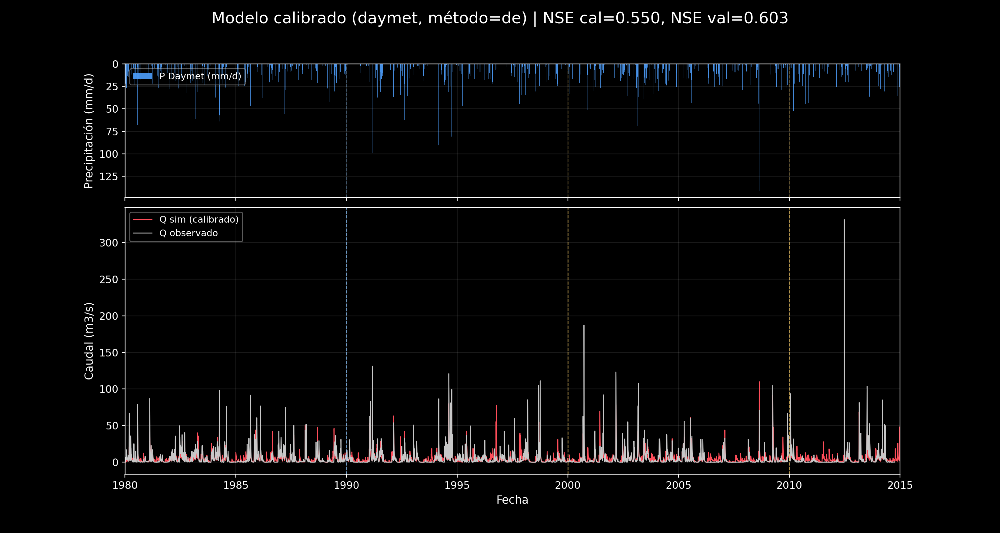
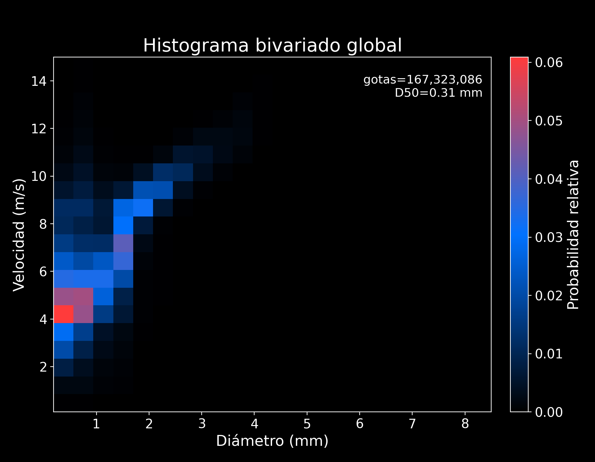
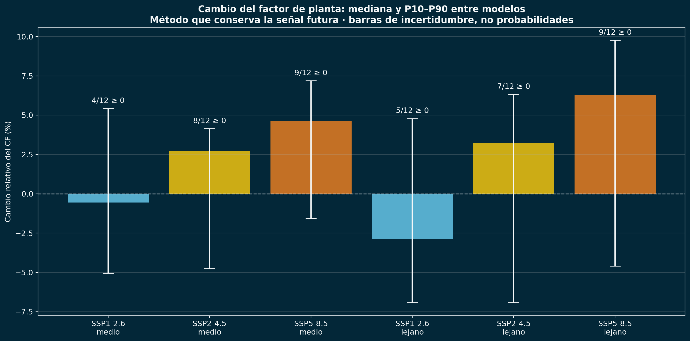

<section class="hero" aria-labelledby="nombre">
  

    
Ingeniería Ambiental · Portafolio académico

    <h1 id="nombre">Linda Catalina Correa Lozano</h1>
    
Datos para entender el agua, el clima y el territorio.

    
Soy estudiante de la Universidad Nacional de Colombia, sede Medellín. Combino mi formación ambiental con programación y análisis geográfico para convertir información compleja en resultados claros y verificables.

    

      <a class="button primary" href="#proyectos">Explorar proyectos ↗</a>
      <a class="button secondary" href="assets/docs/CV_Linda_Catalina_Correa_Lozano.pdf" download>Descargar hoja de vida ↓</a>
    

    
Habilitada para práctica académica · Medellín, Colombia

  

  <aside class="approach" aria-labelledby="forma-trabajo">
    
Mi forma de trabajar

    <h2 id="forma-trabajo">Del dato al resultado.</h2>
    <ol class="workflow">
      <li>01
<strong>Integrar y validar</strong>
Revisar las fuentes y la calidad de la información.

</li>
      <li>02
<strong>Modelar y comparar</strong>
Explorar patrones, escenarios y sus límites.

</li>
      <li>03
<strong>Comunicar y documentar</strong>
Explicar los resultados y cómo se obtuvieron.

</li>
    </ol>
  </aside>
</section>

<section id="proyectos" class="section-block" aria-labelledby="titulo-proyectos">
  

    

01 / Trabajo realizado
<h2 id="titulo-proyectos">Cuatro proyectos, una base común.</h2>

    
Aplicar datos y conocimiento ambiental a preguntas concretas.

  

  
Proyectos académicos desarrollados junto a <a href="https://github.com/CamiloBedoyaC">Juan Camilo Bedoya Carmona</a>, en un equipo de dos personas.

  

    <article class="project-card" aria-labelledby="titulo-hidrologia">
      
Hidrología2026-I

      <h3 id="titulo-hidrologia">Simulación hidrológica de una cuenca</h3>
      
Un modelo en Python para estudiar cómo responde una cuenca a la lluvia y comparar los caudales simulados con los observados.

      
<strong>12.784</strong> registros diarios de CAMELS-US

      <a class="figure-link dark-figure" href="assets/img/hidrologia.png" aria-label="Ampliar figura: caudal observado y simulado en la cuenca Sopchoppy">
        
        Caudales observados y simulados ↗
      </a>
      

Método y resultados

        
Integramos datos diarios, límites de cuenca y estaciones. Calibramos y validamos un modelo de lluvia y escorrentía, y generamos mapas interactivos y reportes automáticos.

        
La mejor combinación alcanzó un <strong>NSE de 0,603 en validación</strong>, una medida del ajuste de los caudales simulados. El análisis también muestra las dificultades del modelo para representar las crecidas.

        
<strong>Herramientas:</strong> Python, SciPy, Leaflet y Plotly.

        <a class="inline-link" href="/assets/docs/reporte-hidrologico.html">Abrir el informe interactivo ↗</a>
      

      <a class="project-link" href="https://github.com/CamiloBedoyaC/modelo-hidrologico">Ver código, metodología y resultados ↗</a>
    </article>

    <article class="project-card" aria-labelledby="titulo-precipitacion">
      
Calidad de datos2025-II

      <h3 id="titulo-precipitacion">Análisis de precipitación con SIATA y NOAA</h3>
      
Procesamiento de observaciones de lluvia de Santa Elena, Antioquia, para estudiar las gotas y su relación con las condiciones atmosféricas.

      
<strong>167,3 millones</strong> de partículas válidas analizadas

      <a class="figure-link dark-figure" href="assets/img/precipitacion.png" aria-label="Ampliar figura: tamaño y velocidad de caída de las gotas">
        
        Tamaño y velocidad de las gotas ↗
      </a>
      

Método y resultados

        
Procesamos <strong>5,28 GB de datos por bloques</strong> para evitar cargar todo el histórico en memoria. Aplicamos controles de calidad e integramos variables atmosféricas de NOAA.

        
Generamos 14 figuras, tablas de resultados y pruebas automatizadas. Las relaciones con las variables atmosféricas fueron débiles y se presentan como asociaciones exploratorias.

        
<strong>Herramientas:</strong> Python, pandas, NumPy y Matplotlib.

      

      <a class="project-link" href="https://github.com/LindaCatalina/siata-disdrometer-rainfall-microphysics">Ver código, metodología y resultados ↗</a>
    </article>

    <article class="project-card" aria-labelledby="titulo-eolica">
      
Clima y energía2025-II

      <h3 id="titulo-eolica">Riesgo climático para la generación eólica</h3>
      
Evaluación de posibles cambios en el potencial de una planta eólica virtual en La Guajira, considerando distintos escenarios climáticos.

      
<strong>12 modelos</strong> climáticos · 3 escenarios futuros

      <a class="figure-link wind-figure" href="assets/img/eolica.png" aria-label="Ampliar figura: cambios del factor de planta en los escenarios climáticos">
        
        Escenarios y rangos de incertidumbre ↗
      </a>
      

Método y resultados

        
Integramos ERA5-Land y proyecciones de CMIP6, corregimos diferencias sistemáticas y estimamos cambios en el factor de planta.

        
El conjunto de modelos no muestra una disminución común a los tres escenarios. La dispersión entre modelos y la sensibilidad al método son importantes para interpretar el riesgo.

        
<strong>Herramientas:</strong> Python, pandas, xarray y Matplotlib. Es un caso académico inspirado en Jemeiwaa Ka'I.

      

      <a class="project-link" href="https://github.com/LindaCatalina/jemeiwaa-wind-energy-climate-risk">Ver código, metodología y resultados ↗</a>
    </article>

    <article class="project-card" aria-labelledby="titulo-mjo">
      
Climatología2025-II

      <h3 id="titulo-mjo">Estabilidad atmosférica durante la MJO</h3>
      
Estudio de cómo cambia la estabilidad de la atmósfera en Palau y Chuuk durante las fases de la oscilación de Madden-Julian.

      
<strong>33.096</strong> registros diarios · 2 estaciones

      <a class="figure-link dark-figure" href="assets/img/mjo.png" aria-label="Ampliar figura: anomalías de estabilidad de Palau y Chuuk durante la fase cuatro de la MJO">
        
        Fase 4: esquema y resultados por estación ↗
      </a>
      

Método y resultados

        
Integramos radiosondeos de NOAA de 1980 a 2025 y el índice de la MJO. Calculamos promedios históricos y anomalías, y generamos tablas y visualizaciones interactivas.

        
Encontramos anomalías negativas en las fases 1–2 y positivas en las fases 4–6, con diferencias entre estaciones. El resultado describe una asociación, no una prueba de causalidad ni un pronóstico.

        
<strong>Herramientas:</strong> Python, análisis de series, CSV/Parquet y visualización interactiva.

        <a class="inline-link" href="https://camilobedoyac.github.io/mjo-atmospheric-stability/hist-unificado-site/hist_unificado.html">Explorar la visualización interactiva ↗</a>
      

      <a class="project-link" href="https://github.com/CamiloBedoyaC/mjo-atmospheric-stability">Ver código, metodología y resultados ↗</a>
    </article>
  

</section>

<section id="competencias" class="section-block" aria-labelledby="titulo-competencias">
  

02 / Capacidades
<h2 id="titulo-competencias">Herramientas con un propósito.</h2>

  

    
<h3>Datos y modelos</h3>
Integración, control de calidad, análisis estadístico y simulación.

Python · R · pandas · NumPy · xarray · SciPy

    
<h3>Mapas y visualización</h3>
Análisis espacial y presentación de resultados para facilitar su interpretación.

QGIS · Google Earth Engine · Cartopy · Leaflet · Matplotlib · Plotly

    
<h3>Desarrollo y documentación</h3>
Organización del código, automatización y reportes que pueden revisarse.

Git · GitHub · Jupyter · VS Code · LaTeX · Excel

  

  
<strong>En equipo:</strong> comparto conocimientos y escucho otros puntos de vista. Ante una dificultad, investigo, pruebo alternativas y busco apoyo cuando es necesario.

</section>

<section id="formacion" class="section-block formation" aria-labelledby="titulo-formacion">
  

    
03 / Aprendizaje

    <h2 id="titulo-formacion">Formación que acompaña la práctica.</h2>
    
Complemento la ingeniería ambiental con análisis de datos, climatología y herramientas geográficas.

    
Promedio: <strong>4,3/5,0</strong>Inglés: <strong>C1 · EF SET</strong>

  

  

    <h3>Asignaturas de posgrado</h3>
    
Analítica descriptiva y visualización de datos · Analítica predictiva · Producto de datos · Climatología.

    <h3>Curso realizado</h3>
    
Geoanalítica: transforma datos en decisiones — Esri, 2026.

    

Formación y certificaciones en progreso

      <ul>
        <li><strong>Python:</strong> CS50P — Harvard.</li>
        <li><strong>SQL y bases de datos:</strong> CS50 SQL — Harvard.</li>
        <li><strong>Ciencia de datos y aprendizaje automático:</strong> Kaggle y Google ML Crash Course.</li>
        <li><strong>Ingeniería de datos:</strong> DataTalks.Club e IBM Data Engineering.</li>
        <li><strong>Análisis geoespacial:</strong> GeoPython y cursos MOOC de Esri.</li>
        <li><strong>Teledetección:</strong> NASA ARSET.</li>
        <li><strong>Nube y despliegue:</strong> AWS.</li>
      </ul>
    

  

</section>

<section id="contacto" class="contact-section" aria-labelledby="titulo-contacto">
  

04 / Conversemos
<h2 id="titulo-contacto">Hablemos de nuevas oportunidades.</h2>
Busco una práctica en análisis de datos o gestión ambiental, con especial interés en energía, recursos hídricos e infraestructura.

  
<a class="contact-email" href="mailto:licorrea@unal.edu.co">licorrea@unal.edu.co ↗</a><a class="contact-email" href="mailto:linda8.catalina@gmail.com">linda8.catalina@gmail.com ↗</a><a href="https://github.com/LindaCatalina">Explorar mi GitHub ↗</a>

</section>
